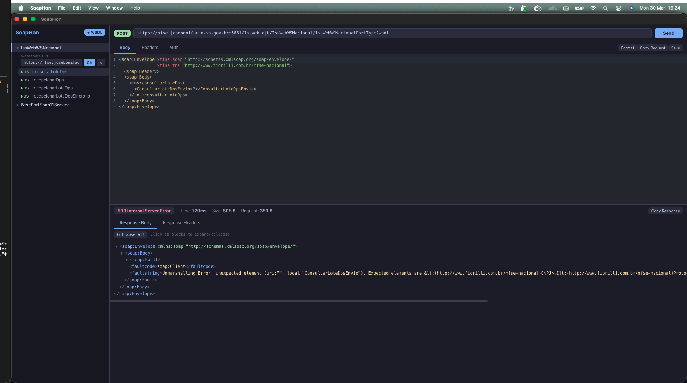

# SoapHon

<p align="center">
  
</p>

<p align="center">
  <strong>Deskotp SOAP Client multiplataforma com interface desktop moderna.</strong>
</p>

<p align="center">
  
</p>

<p align="center">
  <a href="#portugues">Portugues</a> | <a href="#english">English</a>
</p>

---

<a id="portugues"></a>

## Portugues

### O que e o SoapHon?

SoapHon e um cliente SOAP desktop construido com Electron, React e TypeScript. Ele permite importar WSDLs, visualizar os metodos expostos, montar e enviar requisicoes SOAP, e inspecionar as respostas XML com blocos colapsaveis — tudo com uma interface moderna e intuitiva.

### Features

- **Importar WSDL** — Carregue um WSDL a partir de uma URL. O parser extrai automaticamente o nome do servico, endpoint, operacoes e gera templates de envelope SOAP para cada metodo.
- **Arvore de projetos** — Sidebar organizada com projetos, operacoes e requests salvas em estrutura colapsavel.
- **Editor XML** — Editor de corpo da requisicao com syntax highlighting (CodeMirror 6), numeracao de linhas e atalhos de teclado.
- **Headers customizados** — Adicione, edite, habilite/desabilite headers HTTP personalizados por requisicao.
- **Autenticacao** — Suporte a Basic Auth, Bearer Token e WS-Security (UsernameToken injetado automaticamente no envelope SOAP).
- **URL editavel** — Visualize e edite a URL do webservice a qualquer momento, tanto na sidebar quanto na barra de envio.
- **Renomear projetos** — Duplo-clique ou clique direito para renomear o nome do webservice importado.
- **Salvar requisicoes** — Persista requests no SQLite com nome, headers, auth e ultima resposta.
- **Copiar request/response** — Botoes para copiar o XML da requisicao ou da resposta para a area de transferencia.
- **Resposta XML colapsavel** — Visualize a resposta XML com syntax highlighting e blocos que podem ser abertos/fechados individualmente ou todos de uma vez.
- **Informacoes da resposta** — Status code, status text, tempo de resposta, tamanho do request e response, headers da resposta.
- **SSL flexivel** — Suporte a certificados auto-assinados (ignora verificacao de certificado).
- **Multiplataforma** — Funciona no macOS, Windows e Linux.

### Como realizar o Build

#### Pre-requisitos

- [Node.js](https://nodejs.org/) >= 18
- npm >= 9

#### Instalar dependencias

```bash
npm install
```

#### Desenvolvimento

```bash
npm run dev
```

#### Build de producao

```bash
npm run build
```

#### Gerar instalador

##### macOS

```bash
# Sem assinatura de codigo (para uso local)
npx electron-vite build && CSC_IDENTITY_AUTO_DISCOVERY=false npx electron-builder --config electron-builder.yml --mac                                                                                                                                                       
# Gera: dist/SoapHon-x.x.x-arm64.dmg e dist/SoapHon-x.x.x-arm64-mac.zip
```

##### Windows

```bash
npx electron-builder --config electron-builder.yml --win

# Gera: dist/SoapHon Setup x.x.x.exe (instalador NSIS)
```

##### Linux

```bash
npx electron-builder --config electron-builder.yml --linux

# Gera: dist/SoapHon-x.x.x.AppImage e dist/soaphon_x.x.x_amd64.deb
```

> **Nota:** Para build cross-platform (ex: gerar .exe no macOS), pode ser necessario usar Docker ou CI (ex: GitHub Actions).

### Instalacao

| Plataforma | Formato | Como instalar |
|---|---|---|
| macOS | `.dmg` | Abra o DMG e arraste o SoapHon para a pasta Aplicativos |
| macOS | `.zip` | Descompacte e mova o `.app` para Aplicativos |
| Windows | `.exe` | Execute o instalador NSIS e siga as instrucoes |
| Linux | `.AppImage` | `chmod +x SoapHon-*.AppImage && ./SoapHon-*.AppImage` |
| Linux | `.deb` | `sudo dpkg -i soaphon_*.deb` |

---

<a id="english"></a>

## English

### What is SoapHon?

SoapHon is a cross-platform SOAP client desktop application built with Electron, React, and TypeScript. It lets you import WSDLs, browse exposed methods, compose and send SOAP requests, and inspect XML responses with collapsible blocks — all within a modern, intuitive interface.

### Features

- **Import WSDL** — Load a WSDL from a URL. The parser automatically extracts the service name, endpoint, operations, and generates SOAP envelope templates for each method.
- **Project tree** — Organized sidebar with projects, operations, and saved requests in a collapsible tree structure.
- **XML editor** — Request body editor with syntax highlighting (CodeMirror 6), line numbers, and keyboard shortcuts.
- **Custom headers** — Add, edit, enable/disable custom HTTP headers per request.
- **Authentication** — Support for Basic Auth, Bearer Token, and WS-Security (UsernameToken automatically injected into the SOAP envelope).
- **Editable URL** — View and edit the webservice URL at any time, from the sidebar or the send bar.
- **Rename projects** — Double-click or right-click to rename the imported webservice.
- **Save requests** — Persist requests in SQLite with name, headers, auth, and last response.
- **Copy request/response** — Buttons to copy the request or response XML to the clipboard.
- **Collapsible XML response** — View the XML response with syntax highlighting and blocks that can be individually or globally expanded/collapsed.
- **Response info** — Status code, status text, response time, request and response size, response headers.
- **Flexible SSL** — Support for self-signed certificates (skips certificate verification).
- **Cross-platform** — Works on macOS, Windows, and Linux.

### How to Build

#### Prerequisites

- [Node.js](https://nodejs.org/) >= 18
- npm >= 9

#### Install dependencies

```bash
npm install
```

#### Development

```bash
npm run dev
```

#### Production build

```bash
npm run build
```

#### Generate installer

##### macOS

```bash
# Without code signing (for local use)
CSC_IDENTITY_AUTO_DISCOVERY=false npx electron-builder --config electron-builder.yml --mac

# Outputs: dist/SoapHon-x.x.x-arm64.dmg and dist/SoapHon-x.x.x-arm64-mac.zip
```

##### Windows

```bash
npx electron-builder --config electron-builder.yml --win

# Outputs: dist/SoapHon Setup x.x.x.exe (NSIS installer)
```

##### Linux

```bash
npx electron-builder --config electron-builder.yml --linux

# Outputs: dist/SoapHon-x.x.x.AppImage and dist/soaphon_x.x.x_amd64.deb
```

> **Note:** For cross-platform builds (e.g., generating .exe on macOS), you may need Docker or CI (e.g., GitHub Actions).

### Installation

| Platform | Format | How to install |
|---|---|---|
| macOS | `.dmg` | Open the DMG and drag SoapHon to the Applications folder |
| macOS | `.zip` | Unzip and move the `.app` to Applications |
| Windows | `.exe` | Run the NSIS installer and follow the instructions |
| Linux | `.AppImage` | `chmod +x SoapHon-*.AppImage && ./SoapHon-*.AppImage` |
| Linux | `.deb` | `sudo dpkg -i soaphon_*.deb` |

---

## Tech Stack

- **Electron** — Desktop runtime
- **React** + **TypeScript** — UI
- **CodeMirror 6** — XML editor
- **better-sqlite3** — Local persistence
- **fast-xml-parser** — WSDL/XML parsing
- **axios** — HTTP client
- **Zustand** — State management
- **electron-vite** — Build tooling
- **electron-builder** — Packaging

## License

MIT
